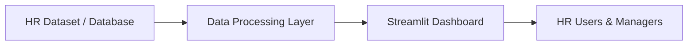

# HR Analytics Dashboard


## Project Overview

The HR Analytics Dashboard is an interactive data analytics solution designed to help HR teams, managers, and decision-makers understand workforce data quickly and effectively.

Instead of working with large spreadsheets or raw datasets, the dashboard transforms employee data into clear metrics and visual insights, all presented in a single, easy-to-read interface.

The dashboard focuses on key HR indicators such as employee count, attrition, performance, income, and tenure, enabling faster and more informed decision-making.

---

## Why This Dashboard Matters

HR departments often deal with complex and high-volume workforce data. This dashboard simplifies analysis by:

- Converting raw employee data into **meaningful, actionable insights**
- Highlighting potential **risk areas**, such as high attrition
- Supporting **strategic HR and management decisions**
- Saving time by presenting all key metrics in **one unified view**

The dashboard is intentionally designed to be accessible for **non-technical users**, including managers and executives.

---

## What Does the Dashboard Show?

### Executive Overview

A quick snapshot of overall workforce health, including employee count, attrition rate, average income, and performance.

---

### Workforce and Attrition Insights

Visual insights showing how employees are distributed across departments, attrition patterns, and performance ratings.


---

### Compensation and Workforce Trends

Trends related to employee income and tenure, supporting analysis of retention and compensation structure.

---

## Dashboard Architecture



## Data Interaction Features

The dashboard supports basic HR operations directly from the interface:

### Add New Employee Records

- HR staff can add new employee information through the dashboard.

### Update Employee Income

- Existing employee salaries can be updated easily.

All changes are:
- Saved permanently
- Reflected immediately in the dashboard visuals

---

## Data Storage

Employee data is stored in a **local database file**, ensuring that:

- Data persists after the application is closed
- Newly added employees remain saved
- Salary updates are preserved

Each time the dashboard runs, it loads the **most up-to-date version of the data**.

---

## Target Users

This dashboard is suitable for:

- HR teams
- Department managers
- Business stakeholders
- Executives seeking high-level workforce insights

It is built with a strong focus on **clarity, speed, and practical usability**.

---

## Design Approach

The dashboard follows professional analytics and business design standards:

- One-page layout for clear visibility
- Clean, minimal visuals focused on insights
- Soft background colors with white content sections
- Color palette aligned with **Solutions by STC** branding

**Design principle:** clarity over complexity.

---

## Project Structure

The project consists of two main components:

### Data Analysis Notebook
- Jupyter Notebook used for data exploration, cleaning, and analysis.

### Dashboard Application
- Python-based application that displays interactive visualizations and metrics.

---

## Technical Information

### Programming Languages
- Python
- SQL

### Tools and Technologies
- Data analysis and processing
- Local database storage
- Interactive web-based dashboard using **Streamlit**

---
## Dependencies

All required libraries and their exact versions are listed in the `requirements.txt` file.

To ensure compatibility and reproducibility, please install dependencies using:

```bash
pip install -r requirements.txt
```

## How to Run the Dashboard

1. Activate your Python environment
2. Navigate to the project directory
3. Install required dependencies:
   ```bash
   pip install -r requirements.txt
 4. Run the dashboard:
    ```bash
    streamlit run app.py
 5. Open the dashboard in your browse
    ```bash
    http://localhost:8501

## Summary

The HR Analytics Dashboard transforms employee data into clear and actionable insights.
It helps organizations to:

- Understand workforce dynamics more effectively
- Identify potential risks early
- Support informed HR and business decisions
- Access all key HR metrics in one centralized interface
    

  
